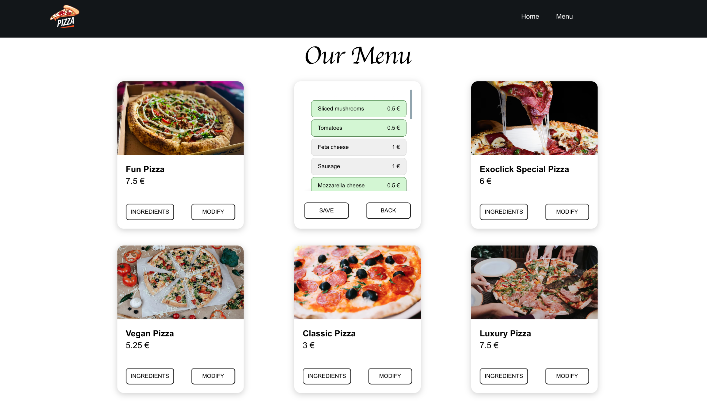

 

  <h3 align="center">Pizza Recipe</h3>

  

    A simple APP can DIY your pizza
     
     
    <a href="https://github.com/hxueqi/pizza_store.git"><strong>Explore the docs »</strong></a>
     
     
  

## Table Of Contents

- [About the Project](#about-the-project)
- [Built With](#built-with)
- [Getting Started](#getting-started)
- [Usage](#usage)
- [Future version project](#Future version project)
- [Authors](#authors)
- [Acknowledgements](#acknowledgements)

## About The Project

This application allows users to manage a catalog of pizzas and their corresponding ingredients. Users can add and remove ingredients from existing pizzas and specify their order of appearance.

Here's why:

- You can check what pizza you have in the catalog including name, price, and ingredients.
- You can modify your pizza recipe.

A list of commonly used resources that I find helpful are listed in the acknowledgements.

## Built With

This project is created by ReactJS, MySQL, CSS, ESLint

## Getting Started

Clone down this repository. You will need node and npm installed globally on your machine.

Installation:

npm install

To Start Server:

npm start

To Visit App:

localhost:3000/

## Usage

Pizzas

- To see the ingredients of pizza, click the INGREDIENTS button
- To modify the ingredients of pizza, click the MODIFY button
- The selling price of a pizza equals the total of all its ingredients plus 50% of the total for the preparation.

Ingredients

- To add a new ingredient, click on the name of ingredient, the color change to green.
- To remove an ingredient, click on the name of ingredient, the color change to grey.

## Future version project

- Authentication
- Do end to end test with Cypress
- Use Husky for commit configuration and to launch validations

## Contributing

Contributions are what make the open source community such an amazing place to be learn, inspire, and create. Any contributions you make are **greatly appreciated**.

- If you have suggestions for adding or removing projects, feel free to [open an issue](https://github.com/Xueqi/ReadME-pizza_store/issues/new) to discuss it, or directly create a pull request after you edit the _README.md_ file with necessary changes.
- Please make sure you check your spelling and grammar.
- Create individual PR for each suggestion.
- Please also read through the [Code Of Conduct](https://github.com/Xueqi/ReadME-pizza_store/blob/main/CODE_OF_CONDUCT.md) before posting your first idea as well.

### Creating A Pull Request

1. Fork the Project
2. Create your Feature Branch (`git checkout -b feature/AmazingFeature`)
3. Commit your Changes (`git commit -m 'Add some AmazingFeature'`)
4. Push to the Branch (`git push origin feature/AmazingFeature`)
5. Open a Pull Request

## Authors

- **Xueqi Huang** - _FullstackDev_ - [Xueqi](https://github.com/hxueqi) -

## Acknowledgements

- [React](https://reactjs.org/)
- [Jest](https://jestjs.io/)
- [Eslint](https://eslint.org/)
